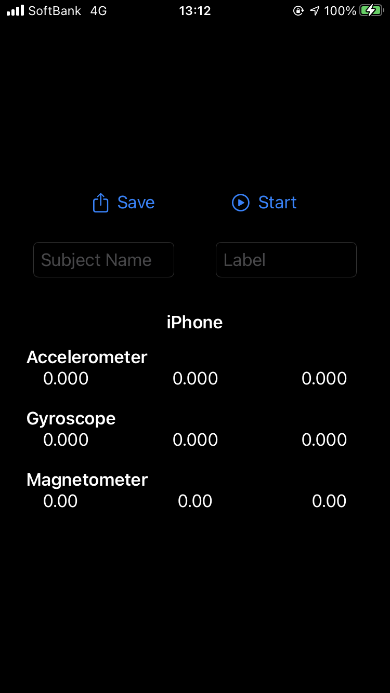
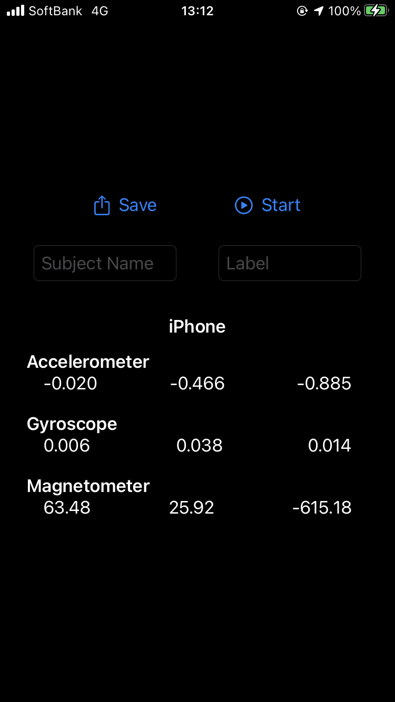

#  Logger

This application can measure acceleraton data, gyroscope data and magnetic data, and save them in CSV file.

 |  
:-:|:-:

## Version
5.1.2

- Note: Logger v4 (With Storyboard) is [this](https://github.com/Shakshi3104/LoggerGit).

## Requirements
- iOS 13.1+
- Xcode 11.5+

## Update History

|Version|Update Date|Contents|
|:----:|:-------------:|:---------|
|5.0.0|2020/2/20| Implement UI|
|5.0.1|2020/5/3| Implement internals|
|5.0.2|2020/5/4| Release 1st version|
|5.1.0|2020/5/30| Add line chart|
|5.1.1|2020/8/1| Add Haptic Engine feedback|
|5.1.2|2020/9/29| Improve internal implementation|
