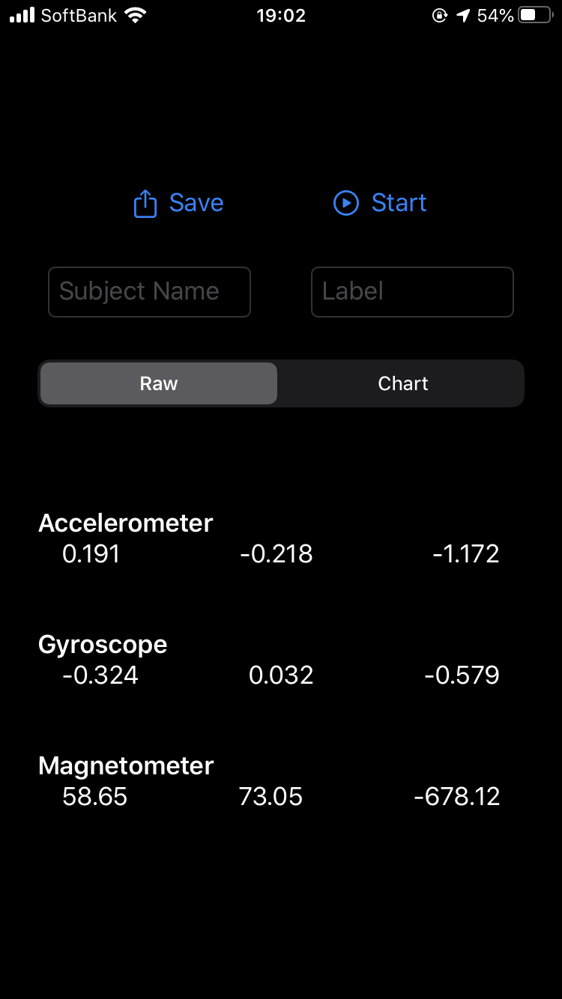
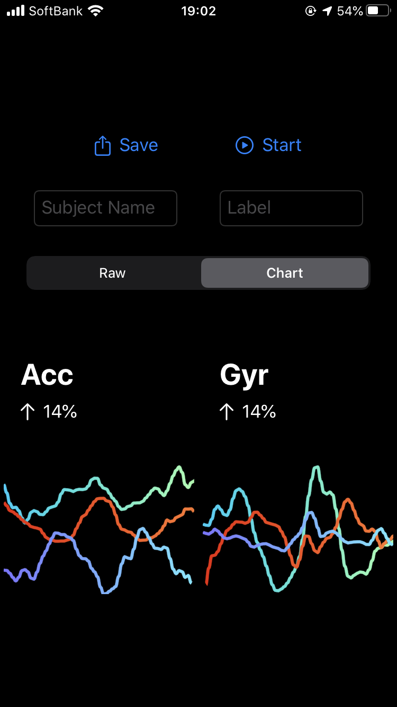
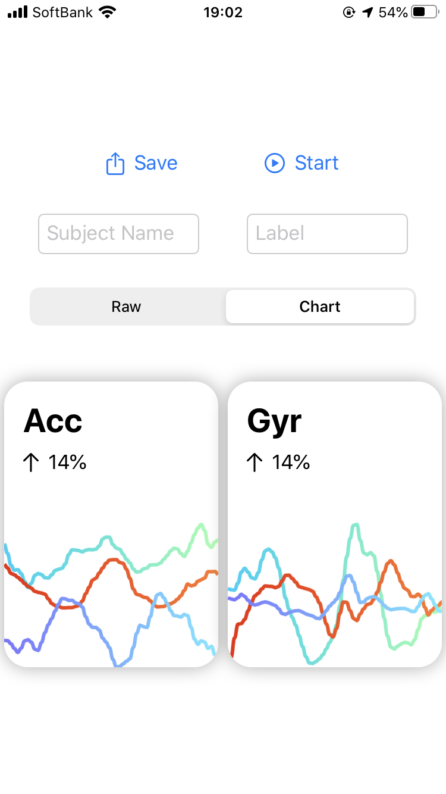

#  Logger

This application can measure acceleraton data, gyroscope data and magnetic data, and save them in CSV file.

## Requirements
- iOS 13.1+
- Xcode 11.5

## Swift Package Dependencies
- [SwiftUICharts](https://github.com/AppPear/ChartView)
