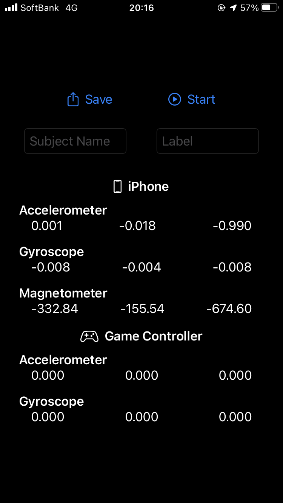
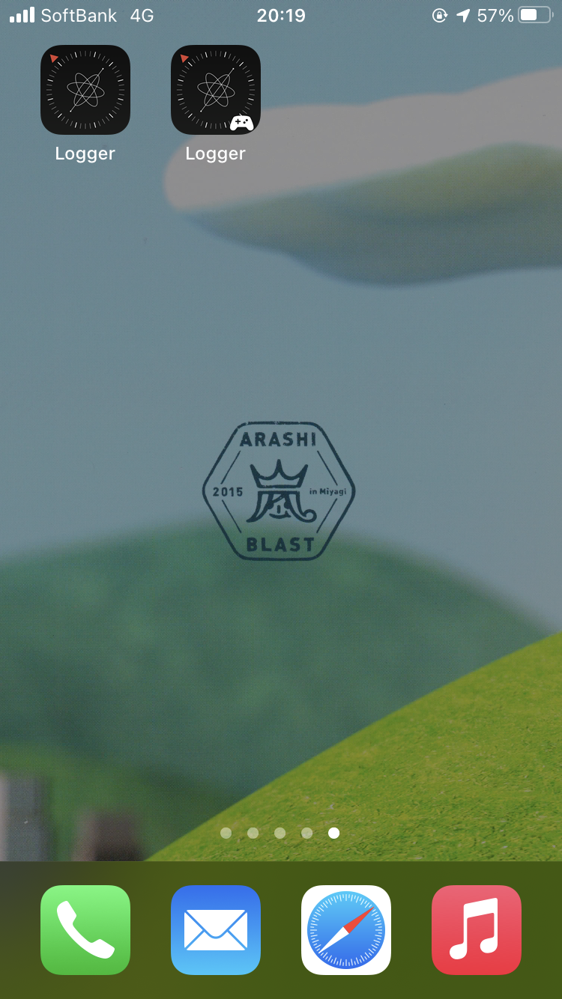

#  Logger Controller

This application can measure acceleraton data, gyroscope data and magnetic data, and save them in CSV file.

This also measure acceleration and gyroscope data of a game controller.

- Note : I don't know if it will work because I haven't tested this app on a real device.

Screenshot | Logger Series
:-:|:-:
 |  

## Version
0.9.0

## Requirements
- iOS 14.0+
- Xcode 12.0.1+
