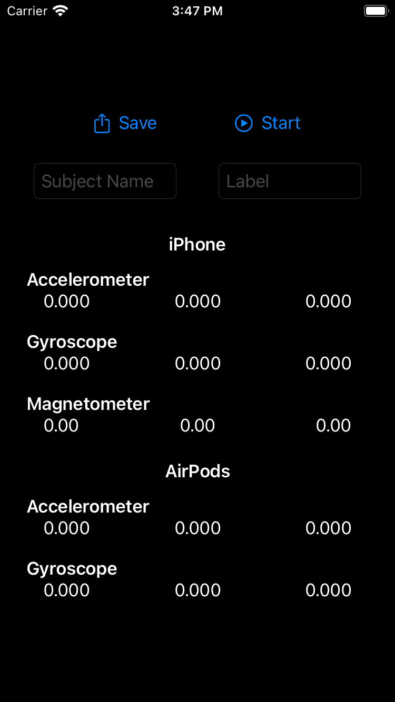
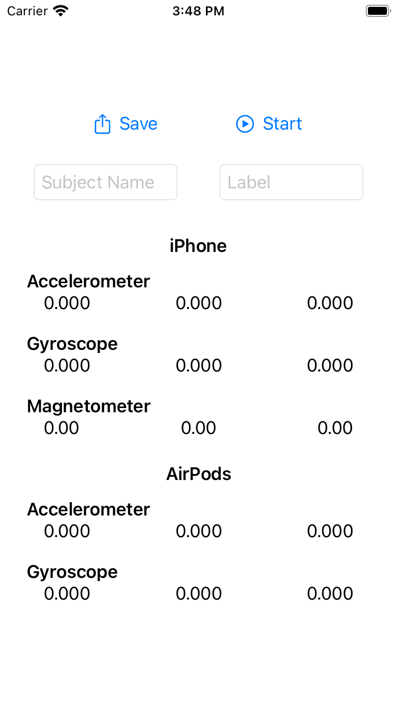

#  Logger

This application can measure acceleraton data, gyroscope data and magnetic data, and save them in CSV file.

This application also can measure headphone's acceleration data and gyroscope data in iOS 14.

- Note: Apparently, [CMHeadphoneMotionManager](https://developer.apple.com/documentation/coremotion/cmheadphonemotionmanager) is not yet implemented within Core Motion. So, maybe this application is not working.

 |  
:-:|:-:

## Version
5.2.0 Beta

- Note: Logger v4 (With Storyboard) is [this](https://github.com/Shakshi3104/LoggerGit).

## Requirements
- iOS 14.0+
- Xcode 12.0+

## Update History

|Version|Update Date|Contents|
|:----:|:-------------:|:---------|
|5.0.0|2020/2/20| Implement UI|
|5.0.1|2020/5/3| Implement internals|
|5.0.2|2020/5/4| Release 1st version|
|5.1.0|2020/5/30| Add line chart|
|5.1.1|2020/8/1| Add Haptic Engine feedback|
|5.2.0|2020/8/21| (Beta) Implement the function to collect headphone's acceleration data and gyroscope data|
